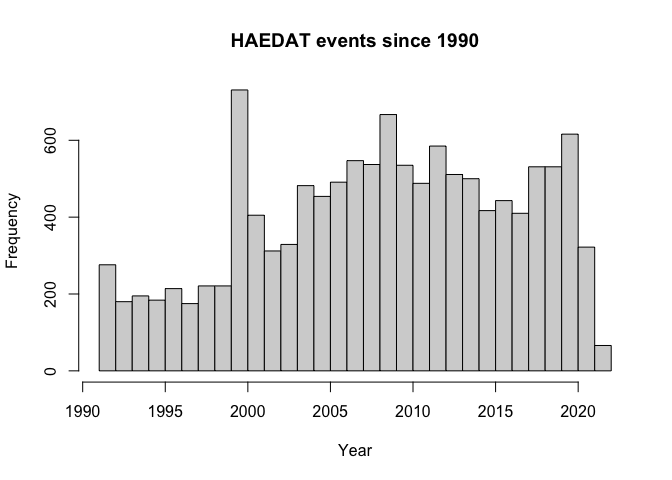

HAEDAT in R
================

Simple access to downloading and reading
[HAEDAT](https://ipt.iobis.org/hab/resource?r=haedat) data in R

### Requirements

-   [R v4.1+](https://www.r-project.org/)

-   [rlang](https://CRAN.R-project.org/package=rlang)

-   [dplyr](https://CRAN.R-project.org/package=dplyr)

-   [readr](https://CRAN.R-project.org/package=readr)

-   [rappdirs](https://CRAN.R-project.org/package=rappdirs)

-   [finch](https://CRAN.R-project.org/package=finch)

-   [sf](https://CRAN.R-project.org/package=sf)

### Installation

``` r
remotes::install_github("BigelowLab/haedat")
```

### Initial Usage

#### Establish a root data directory

Please establish the storage directory with `haedat_root()`. You can
store data where ever you would like, but we suggest that you accept the
default and ignore of all of details and mayhem that ensue with custom
installations.

``` r
haedat::haedat_root()
```

#### Fetch the data

The following will fetch and store the haedat data in DWCA format
(Darwin Core Archive). You only need to do this occasionally as the data
is updated online.

``` r
headat::fetch_haedat()
```

#### Usage

Read the data into a list or three elements: `events`, `occurrences` and
`extendedmeasurementorfact`. Each of the tables has an `id` which can be
used for merging.

``` r
suppressPackageStartupMessages({
  library(haedat)
  library(dplyr)
  library(sf)
  library(maps)
})

x <- read_haedat()
```

    ## Registered S3 method overwritten by 'finch':
    ##   method         from 
    ##   print.location dplyr

    ## File in cache

``` r
lapply(x, head)
```

    ## $event
    ## Simple feature collection with 6 features and 10 fields
    ## Geometry type: POINT
    ## Dimension:     XY
    ## Bounding box:  xmin: -125.9 ymin: 44.67 xmax: -56.19 ymax: 50.55
    ## Geodetic CRS:  WGS 84
    ## # A tibble: 6 × 11
    ##   id     eventID event…¹ event…² highe…³ country local…⁴ geode…⁵ coord…⁶ footp…⁷
    ##   <chr>  <chr>   <chr>   <chr>   <chr>   <chr>   <chr>   <chr>     <dbl> <chr>  
    ## 1 HAEDA… HAEDAT… 1992    HAEDAT… Scotia… CANADA  "Halif… EPSG:4…  100000 ""     
    ## 2 HAEDA… HAEDAT… 1992    HAEDAT… Gulf R… CANADA  "Easte… EPSG:4…  100000 ""     
    ## 3 HAEDA… HAEDAT… 1992    HAEDAT… Gulf R… CANADA  "North… EPSG:4…  100000 ""     
    ## 4 HAEDA… HAEDAT… 1992    HAEDAT… Gulf R… CANADA  "Miram… EPSG:4…  100000 ""     
    ## 5 HAEDA… HAEDAT… 1987    HAEDAT… Pacifi… CANADA  "uknow… EPSG:4…  100000 ""     
    ## 6 HAEDA… HAEDAT… 1987    HAEDAT… Newfou… CANADA  "South… EPSG:4…  100000 ""     
    ## # … with 1 more variable: geometry <POINT [°]>, and abbreviated variable names
    ## #   ¹​eventDate, ²​eventRemarks, ³​higherGeography, ⁴​locality, ⁵​geodeticDatum,
    ## #   ⁶​coordinateUncertaintyInMeters, ⁷​footprintWKT
    ## 
    ## $occurrence
    ## # A tibble: 6 × 13
    ##   id     insti…¹ colle…² datas…³ basis…⁴ occur…⁵ occur…⁶ organ…⁷ organ…⁸ occur…⁹
    ##   <chr>  <chr>   <chr>   <chr>   <chr>   <chr>   <chr>   <chr>   <chr>   <chr>  
    ## 1 HAEDA… IOC-UN… HAEDAT  HAEDAT  HumanO… HAEDAT… ""      "30,00… "cells… present
    ## 2 HAEDA… IOC-UN… HAEDAT  HAEDAT  HumanO… HAEDAT… ""      ""      ""      present
    ## 3 HAEDA… IOC-UN… HAEDAT  HAEDAT  HumanO… HAEDAT… ""      ""      ""      present
    ## 4 HAEDA… IOC-UN… HAEDAT  HAEDAT  HumanO… HAEDAT… ""      ""      ""      present
    ## 5 HAEDA… IOC-UN… HAEDAT  HAEDAT  HumanO… HAEDAT… ""      ""      ""      present
    ## 6 HAEDA… IOC-UN… HAEDAT  HAEDAT  HumanO… HAEDAT… ""      ""      ""      present
    ## # … with 3 more variables: eventID <chr>, scientificNameID <chr>,
    ## #   scientificName <chr>, and abbreviated variable names ¹​institutionCode,
    ## #   ²​collectionCode, ³​datasetName, ⁴​basisOfRecord, ⁵​occurrenceID,
    ## #   ⁶​occurrenceRemarks, ⁷​organismQuantity, ⁸​organismQuantityType,
    ## #   ⁹​occurrenceStatus
    ## 
    ## $extendedmeasurementorfact
    ## # A tibble: 6 × 7
    ##   id                     occurrenceID    measu…¹ measu…² measu…³ measu…⁴ measu…⁵
    ##   <chr>                  <chr>           <chr>   <chr>   <chr>   <chr>   <chr>  
    ## 1 HAEDAT:CA-22:CA-92-002 HAEDAT:CA-22:C… abunda… http:/… 10,400  cells … http:/…
    ## 2 HAEDAT:CA-22:CA-92-003 HAEDAT:CA-22:C… abunda… http:/… 7,000   cells … http:/…
    ## 3 HAEDAT:CA-22:CA-97-001 HAEDAT:CA-22:C… abunda… http:/… 151,776 cells … http:/…
    ## 4 HAEDAT:NL-01:NL-89-001 HAEDAT:NL-01:N… abunda… http:/… 20-800  cells … http:/…
    ## 5 HAEDAT:NL-01:NL-89-002 HAEDAT:NL-01:N… abunda… http:/… 100 - … cells … http:/…
    ## 6 HAEDAT:NL-01:NL-89-003 HAEDAT:NL-01:N… abunda… http:/… 30-300  cells … http:/…
    ## # … with abbreviated variable names ¹​measurementType, ²​measurementTypeID,
    ## #   ³​measurementValue, ⁴​measurementUnit, ⁵​measurementUnitID

### event

Let’s take a look at the spatial distribution.

``` r
event <- x$event
maps::map()
plot(sf::st_geometry(event),
     col = "orange",
     add = TRUE)
```

<!-- -->

What about the distribution through time? Hmmm. The `eventDate` variable
is character which gives one that ‘oh, dear’ feeling. Let’s see about
how long the strings are; if they are all the same it should be easy to
convert to a usable Date or numeric class.

``` r
lens <- nchar(event$eventDate)
tlens <- table(lens)
tlens
```

    ## lens
    ##    4    7    8    9   10   15   16   17   19   20   21 
    ## 3304    6    3    4 6344   34    2   16    6    4 3538

Oh, nuts! What do some of the different lengths look like?

``` r
sapply(names(tlens),
       function(len){
         ix <- lens == as.numeric(len)
         sprintf("len=%s: %s", as.character(len),
                     paste(head(event$eventDate[ix]), collapse = ", "))
       })
```

    ##                                                                                                                                                  4 
    ##                                                                                                        "len=4: 1992, 1992, 1992, 1992, 1987, 1987" 
    ##                                                                                                                                                  7 
    ##                                                                                      "len=7: 1988-05, 88-8-18, 88-4-26, 88-5-26, 88-4-25, 88-7-22" 
    ##                                                                                                                                                  8 
    ##                                                                                                              "len=8: 88-07-28, 88-06-15, 2005-8-5" 
    ##                                                                                                                                                  9 
    ##                                                                                                "len=9: 2007-6-11, 2007-8-28, 2004-8-17, 2004-8-29" 
    ##                                                                                                                                                 10 
    ##                                                                   "len=10: 1991-10-31, 1991-09-27, 1991-06-25, 1991-07-21, 1992-07-21, 1992-05-19" 
    ##                                                                                                                                                 15 
    ##                                     "len=15: 2003-10/2003-10, 2003-09/2003-09, 2004-06/2004-12, 2004-07/2004-07, 2004-08/2004-08, 2004-08/2004-08" 
    ##                                                                                                                                                 16 
    ##                                                                                                       "len=16: 88-10-5/88-10-14, 88-07-13/88-12-6" 
    ##                                                                                                                                                 17 
    ##                         "len=17: 21-07-08/28-07-08, 88-05-16/88-05-17, 88-07-21/88-09-12, 88-06-02/88-07-07, 88-06-02/88-07-07, 88-06-02/88-07-07" 
    ##                                                                                                                                                 19 
    ##             "len=19: 004-02-18/004-03-02, 1988-8-23/1988-8-25, 1988-5-16/1988-5-17, 1988-6-24/1988-7-25, 1988-6-24/1988-7-25, 2011may24/2011may30" 
    ##                                                                                                                                                 20 
    ##                                                   "len=20: 2001/09/10/2001/0916, 2004/11/1/2004/11/07, 2007-06-29/2007-07-6, 2004-06-3/2004-06-16" 
    ##                                                                                                                                                 21 
    ## "len=21: 1990-06-01/1990-06-30, 1990-09-01/1990-09-30, 1992-06-02/1992-09-16, 1992-07-15/1992-07-16, 1995-06-01/1995-08-31, 1998-07-07/1998-08-10"

Groan.

Maybe we just take the one with 4-digits in the first four positions,
call that `eventYear` and drop what doesn’t convert.

``` r
event <- dplyr::mutate(event,
                       eventYear = as.numeric(substring(eventDate, 1,4))) |>
  dplyr::filter(!is.na(eventYear) & eventYear > 1990)
```

    ## Warning in mask$eval_all_mutate(quo): NAs introduced by coercion

``` r
hist(event$eventYear, main = "HAEDAT events since 1990",
     xlab = 'Year',
     breaks = seq(from = min(event$eventYear), to = max(event$eventYear)))
```

<!-- -->
